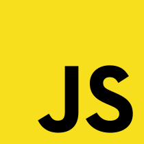

<div id="top"></div>
<!--
*** based https://github.com/othneildrew/Best-README-Template/blob/master/README.md
-->

<!-- PROJECT SHIELDS -->
<!--
*** I'm using markdown "reference style" links for readability.
*** Reference links are enclosed in brackets [ ] instead of parentheses ( ).
*** See the bottom of this document for the declaration of the reference variables
*** for contributors-url, forks-url, etc. This is an optional, concise syntax you may use.
*** https://www.markdownguide.org/basic-syntax/#reference-style-links
-->
[![Contributors][contributors-shield]][contributors-url]
[![Forks][forks-shield]][forks-url]
[![Stargazers][stars-shield]][stars-url]
[![Issues][issues-shield]][issues-url]
<!-- [![linkedin][linkedin-shield]][linkedin-url] #external Badge Ref-->

<!-- PROJECT LOGO -->
<br />
<div align="center">
  <a href="https://github.com/ParkDyel/_study_algorithm">
    
  </a>

  <h3 align="center">한땀한땀 삽질하며 배우는 Algorithm</h3>

  <p align="center">
    이번에는 오직 JavaScript로만 승부를 본다!
    <br />
    <a href="https://github.com/othneildrew/Best-README-Template"><strong>about this readme.md Template »</strong></a>
    <br />
    <br />
    <a href="https://github.com/ParkDyel">Profile</a>
  </p>
</div>


<!-- TABLE OF CONTENTS -->
<details>
  <summary>Table of Contents</summary>
  <ol>
    <li>
      <a href="#about-the-project">About The Project</a>
      <ul>
        <li><a href="#built-with">Built With</a></li>
      </ul>
    </li>
    <li>
      <a href="#getting-started">Getting Started</a>
      <ul>
        <li><a href="#prerequisites">Prerequisites</a></li>
        <li><a href="#installation">Installation</a></li>
      </ul>
    </li>
    <li><a href="#usage">Usage</a></li>
    <li><a href="#roadmap">Roadmap</a></li>
    <li><a href="#contributing">Contributing</a></li>
    <li><a href="#license">License</a></li>
    <li><a href="#contact">Contact</a></li>
    <li><a href="#acknowledgments">Acknowledgments</a></li>
  </ol>
</details>

<!-- ABOUT THE PROJECT -->
## About The Project

학습을 목적으로 한 framework/library 없이 SPA 구현해보는 프로젝트입니다.

<p align="right"><a href="#top">back to top</a></p>

### Built With

* [Vanilla.js](http://vanilla-js.com/)

<p align="right"><a href="#top">back to top</a></p>

<!-- GETTING STARTED -->
## Getting Started

Local에서 JavaScript를 실행시키기 위해 Node.js가 필요합니다!

### Prerequisites

* [Node.js](https://nodejs.org/)

### Installation

대부분의 코드들은 외부 의존성 없이 구현될 예정이지만, 만약 sub_project에 외부 의존성 모듈이 필요한 경우 npm으로 관리할 예정입니다. 

<p align="right"><a href="#top">back to top</a></p>

<!-- USAGE EXAMPLES -->
## Usage

각 sub_project마다 다를 수 있지만 기본적으로 다음과 같습니다.

```bash
npm run test
```

<p align="right"><a href="#top">back to top</a></p>

<!-- ROADMAP -->
## Roadmap

- [ ] 프로그래머스 뽀개기
- [ ] 리트코드 뽀개기 

<p align="right"><a href="#top">back to top</a></p>

<!-- CONTRIBUTING -->
## Contributing

아직 고려해본 적 없습니다.

<p align="right"><a href="#top">back to top</a></p>

<!-- LICENSE -->
## License

MIT

<p align="right"><a href="#top">back to top</a></p>

<!-- CONTACT -->
## Contact

ParkDyel - dyel.sns@gmail.com

Project Link: [https://github.com/ParkDyel/_study_algorithm](https://github.com/ParkDyel/_study_algorithm)

<p align="right"><a href="#top">back to top</a></p>

<!-- ACKNOWLEDGMENTS -->
## Acknowledgments

* [MDN Web Docs - js](https://developer.mozilla.org/en-US/docs/Web/JavaScript)

<p align="right"><a href="#top">back to top</a></p>

<!-- MARKDOWN LINKS & IMAGES -->
<!-- https://www.markdownguide.org/basic-syntax/#reference-style-links -->
[contributors-shield]: https://img.shields.io/github/contributors/ParkDyel/_study_algorithm.svg?style=for-the-badge
[contributors-url]: https://github.com/ParkDyel/_study_algorithm/graphs/contributors
[forks-shield]: https://img.shields.io/github/forks/ParkDyel/_study_algorithm.svg?style=for-the-badge
[forks-url]: https://github.com/ParkDyel/_study_algorithm/network/members
[stars-shield]: https://img.shields.io/github/stars/ParkDyel/_study_algorithm.svg?style=for-the-badge
[stars-url]: https://github.com/ParkDyel/_study_algorithm/stargazers
[issues-shield]: https://img.shields.io/github/issues/ParkDyel/_study_algorithm.svg?style=for-the-badge
[issues-url]: https://github.com/ParkDyel/_study_algorithm/issues
[license-shield]: https://img.shields.io/github/license/ParkDyel/_study_algorithm.svg?style=for-the-badge
